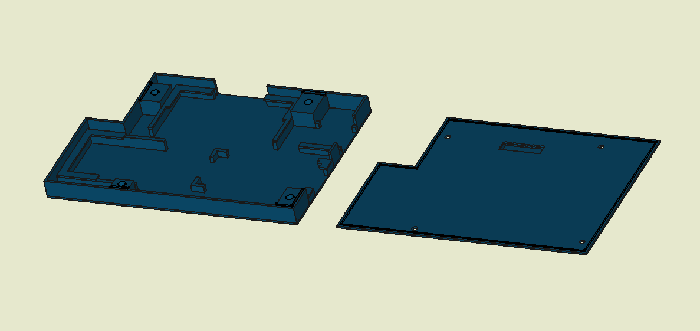
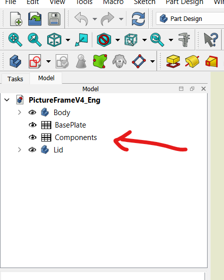

# 3D Modell
- [STL Files](#stl-files)
- [Modifying the 3D Model Using FreeCAD](#modifying-the-3d-model-using-freecad)
- [Exporting for Use in Different CAD Software](#exporting-for-use-in-different-cad-software)

### STL Files
To print the `PictureFrameV4-Body.stl`, position it with the flat side at the bottom, as recommended by your printer. The `PictureFrameV4-Lid.stl` is modeled upside down, so you will need to rotate it 180° in your slicer of choice. If available, use organic supports for printing.

### Modifying the 3D Model Using FreeCAD
*The model was created in FreeCAD 1.0.*

Open the file `3Dmodel/PictureFrameV4Eng.FCStd`. 

**_FreeCAD is not for beginners; only change values if you know what you're doing._**

Every dimension can be adjusted in the "components" section. 

### Exporting for Use in Different CAD Software
You can open `PictureFrameV4_Eng.FCStd` in FreeCAD and export it to a CAD software of your choice. 

To export, click on a component you wish to export, such as *Body*. Then navigate to `File/Export` and choose your desired format. Repeat the same process for the *Lid* component.